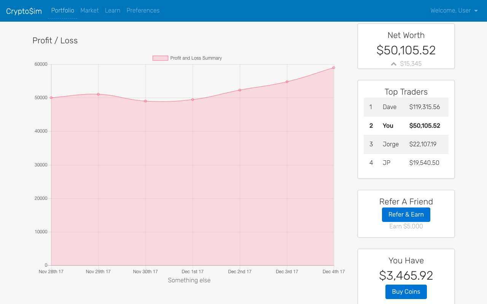

# CryptoSim
#### A crypto currency trading simulator with live prices and user portfolios to track investments

## Synopsis

CryptoSim is an online cryptocurrency trading platform that uses ‘monopoly money’ so users can **test before they invest**. Upon creating an account, users are given $50,000 in ‘monopoly money’ which they can use to invest in any of the 1,800+ cryptocurrencies available.

## Motivation

Trading cryptocurrency can be a scary and abstract concept. We have created this app to help the average person become familiar with trading digital cryptocurrencies without any of the risks associated. 

## Final Product

## Prerequisites:
1. A user must have a Facebook account to login.

## Technologies Used
* [Cryptocompare API](https://www.cryptocompare.com/api/#) 
* [Passport.js](http://www.passportjs.org/) 
* [Express.js](https://expressjs.com/) 
* [Sequelize](http://docs.sequelizejs.com/) 
* [Node](https://nodejs.org/) 
* [Handlebars.js](handlebarsjs.com/) 
* [MySQL](https://www.mysql.com/) 
* [Moment.js](https://momentjs.com/) 

## Created By
[David Lowes](https://github.com/djlowes) 

[William Brooks](https://github.com/thewillwill) 

[JP Oliveira](https://github.com/JPauloBR) 

[Vu Vuong](https://github.com/tsukoni) 

[Jorge Salas](https://github.com/jorgesv16) 

## Acknowledgement
Instructor - David Hallinan

TA - Abraham Fergie

TA - Marco Chan